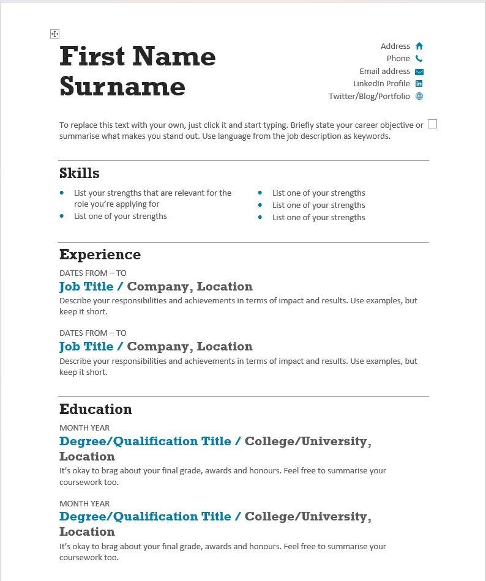
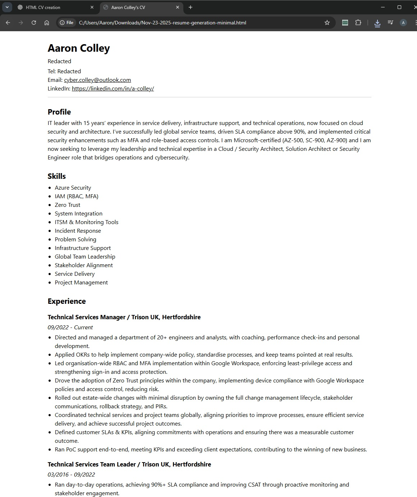

# Frontend Technical Specifiation

- Create a static website that acts as my resume in HTML

## Resume Format Considerations

Living in the UK we want to keep our resume to a PDF format when being sent to recruiters / applications. We do not want to include overly person info, for eg. DOB, photo, full address. This should also be a maximum of 2 pages in length.

We want to ensure our format is ATG freindly to align with company AI checks.

We want to include the following information within our resume in this order:
- Name
- Contact Details
- Linkedin Profile
- Short Summary
- Skills
- Experiance
- Certifactions

### ATG Freindly Template Example

## Resume Format Generation

I have an existing resume using the template above, which is two pages in length, and follows the mentioned considerations. 

 Below are two screenshots one of each page of what my resume looks like, the below has personal info redacted at the top right on the first page.

I will be using ChatGPT 5.1 to generate the base of my HTML using my already created CV and making adjustments to this from there.

### Prompt to ChatGPT 5.1

'''text

I'm doing the cloud resume challenge, as part of this I need to create my existing CV into a HTML format.

I have attached my CV as a PDF that I would like you to convert into HTML, as part of this do not use a CSS framework and use the least amount of CSS tags.
'''

This is the [genereated output](./Docs/Nov-23-2025-resume-generation-minimal.html) which we will refactoring

This is what the generated HTML looks like:

## HTML Refactoring & CSS Styling

The output of the generated HTML is fairly inline wtih our examples, all information has been kept and has mostly followed the format.

- Our provided CV did include my mobile number and address, we have edited the headers on lines 56 and 58 to state "redacted" for privacy purposes, this has been edited in the generated HTML.
- We wanted our page to be using HTML5 and we can see the output has selected "!DOCTYPE html" which is required for HTML this also prevent the viewing browser from switcihng to "quirks mode" when attempting to render.
- As our page will only be using english we can see that it has selected UTF-8 which will serve this purpose.
- Break added to name to put first name above surname
- Address moved down as wasn't with other personal details
- Classes added to sections, Profile, Skills, Experience and Certifications

- I had issues getting the job titles and the location different colours as per my example images. I tried using just the h3 heading but this resulted in both colours being adjusted, I tried to just split them into different h3 headings and then give them each a class but this resulted in the formatting being lost.
After some searching on how to do this I came across the "span" tag which allowed me to break them into two sections, I then assigned a class into each one "job-title" and "company" allowing me to edit each individually

- I now needed to colour match the job title + location as per my CV, to do this I used a free service "colourpicker" to get the hexcode from my existing CV. 

- We now needed to remove the gaps between the job title and the dates, I was having issues finding the best solution for this when adjusting margins etc I was not getting the result I was expecting. I previously added a class"experience" to the experince section, with some GenAI assistance I found I was able to select all the paragrph and h3 tags within this section using this class and assign the margins to all of them at once. 
Simple prompt of the HTML code + "How do I create a minimal gap between job title and date"

- The next challenge was aligning the skills section with our template. We needed the unordered list to be in 3 coloumns with 4 bullet points each, but was struggling to get this to go. After reading through "Multiple Columns" on w3schools, I realised the best way to was to break this into 3 seperate lists, and then use a div with a class to edit them all at once, assining the 3 columns and a flexbox for alignment

- Next I needed to colour the bullet points as per the template, after reading an articale on css-tricks, was able to style as per template by sharing a class between each ul and using the marker command with a colour